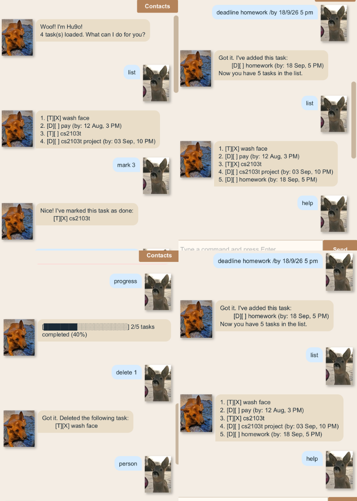

# Hu9o User Guide



Hu9o is a desktop app for managing your **tasks** and **contacts** together, optimized for use via a Command Line Interface (CLI) while still giving you the chat-style look of a Graphical User Interface (GUI). If you can type fast, Hu9o can get your task and contact tracking done faster than a traditional point-and-click app.

## Table of contents

- [Quick start](#quick-start)
- [Layout](#layout)
- [Command format](#command-format)
- [Task features](#task-features)
  - [Adding a todo: `todo`](#adding-a-todo-todo)
  - [Adding a deadline: `deadline`](#adding-a-deadline-deadline)
  - [Adding an event: `event`](#adding-an-event-event)
  - [Listing all tasks: `list`](#listing-all-tasks-list)
  - [Finding tasks: `find`](#finding-tasks-find)
  - [Marking a task as done: `mark`](#marking-a-task-as-done-mark)
  - [Unmarking a task: `unmark`](#unmarking-a-task-unmark)
  - [Deleting a task: `delete`](#deleting-a-task-delete)
  - [Viewing your progress: `progress`](#viewing-your-progress-progress)
- [Contact features](#contact-features)
  - [Adding a person: `person`](#adding-a-person-person)
  - [Listing all people: `people`](#listing-all-people-people)
  - [Finding a person: `findperson`](#finding-a-person-findperson)
  - [Deleting a person: `deleteperson`](#deleting-a-person-deleteperson)
  - [Linking two people: `link`](#linking-two-people-link)
  - [Viewing someone's connections: `connections`](#viewing-someones-connections-connections)
  - [Selecting a person: `select`](#selecting-a-person-select)
  - [Deselecting: `deselect`](#deselecting-deselect)
  - [Viewing the Contacts page (GUI only)](#viewing-the-contacts-page-gui-only)
- [Other features](#other-features)
  - [Greeting Hu9o](#greeting-hu9o)
  - [Clearing the chat: `clear` (GUI only)](#clearing-the-chat-clear-gui-only)
  - [Exiting the program: `bye`](#exiting-the-program-bye)
- [Saving the data](#saving-the-data)
- [Editing the data file](#editing-the-data-file)
- [FAQ](#faq)
- [Known issues](#known-issues)
- [Command summary](#command-summary)

## Quick start

1. Ensure you have **Java 25** installed on your computer.
2. Download the latest `hu9o.jar` from the [Releases page](https://github.com/vishnuroxx/ip/releases). (If no jar has been attached to a release yet, build one yourself from source with `./gradlew shadowJar` — it appears at `build/libs/hu9o.jar`.)
3. Copy the file into the folder you want to use as Hu9o's *home folder* — this is where it will keep its `data/` folder.
4. Open a terminal in that folder and run:
   ```
   java -jar hu9o.jar
   ```
   A chat window should appear after a moment. Hu9o keeps a fixed-size window, so don't expect to resize it.
5. Type a command into the box at the bottom and press Enter (or click **Send**). Some examples to try:
   - `list` — lists all your tasks.
   - `todo read book` — adds a todo named `read book`.
   - `deadline return book /by 12/8/26 6 PM` — adds a deadline.
   - `progress` — shows how much of your list is done.
   - `bye` — saves your data and exits.
6. Refer to [Task features](#task-features) and [Contact features](#contact-features) below for the full command list.

> **Tip:** Hu9o also runs as a plain command-line program with no window — launch `hu9o.Hu9o`'s `main` method instead of the jar's default GUI entry point (`hu9o.gui.Launcher`) if you'd rather use it that way.

## Layout

- The **chat area** in the middle, where your commands and Hu9o's replies appear as speech bubbles.
- The **Contacts button**, top-right, which swaps the chat area for a list of everyone in your contact network — see [Viewing the Contacts page](#viewing-the-contacts-page-gui-only).
- The **input box and Send button** at the bottom, for typing and running commands.

## Command format

> **Note:**
>
> - Words in `UPPER_CASE` are parameters you supply, e.g. in `todo DESCRIPTION`, `DESCRIPTION` is a parameter you'd replace with `read book`, as in `todo read book`.
> - Items in `[square brackets]` are optional, e.g. `person NAME /phone PHONE /email EMAIL [/dob DOB]` can be used as `person John Tan /phone 91234567 /email john@example.com /dob 1/1/2000` or as `person John Tan /phone 91234567 /email john@example.com`.
> - Unlike some apps you may have used, parameters here are introduced by a full word after a slash (e.g. `/phone`, `/email`, `/by`) rather than a single letter, and parameters can be given in any order relative to each other as long as each keeps its own `/keyword`.
> - `INDEX` always refers to the number shown next to an item in the most recent `list` (for tasks) or `people` (for contacts) output, starting from 1.
> - Extra words typed after a command that doesn't take any parameters (such as `list`, `people`, or `deselect`) are simply ignored, e.g. `list please` behaves the same as `list`. `bye` is the one exception — it must be typed on its own, with nothing else on the line.

## Task features

### Adding a todo: `todo`

Adds a todo — a task with no date attached.

Format: `todo DESCRIPTION`

Example: `todo read book`

```
Got it. I've added this task:
	[T][ ] read book
Now you have 1 tasks in the list.
```

### Adding a deadline: `deadline`

Adds a task that needs to be done by a specific date and time.

Format: `deadline DESCRIPTION /by DATE`

`DATE` must be written as `d/M/yy h[mm] a` — for example `12/8/26 3 PM` (3:00 PM) or `12/8/26 330 PM` (3:30 PM). AM/PM is not case-sensitive.

Example: `deadline submit assignment /by 12/8/26 3 PM`

```
Got it. I've added this task:
	[D][ ] submit assignment (by: 12 Aug, 3 PM)
Now you have 2 tasks in the list.
```

### Adding an event: `event`

Adds a task that spans a start and end date/time.

Format: `event DESCRIPTION /from START /to END`

`START` and `END` use the same date format as `deadline`.

Example: `event project meeting /from 12/8/26 2 PM /to 12/8/26 4 PM`

```
Got it. I've added this task:
	[E][ ] project meeting (from: 12 Aug, 2 PM to: 12 Aug, 4 PM)
Now you have 3 tasks in the list.
```

### Listing all tasks: `list`

Shows every task currently in your list, numbered in the order you added them.

Format: `list`

```
1. [T][ ] read book
2. [D][ ] submit assignment (by: 12 Aug, 3 PM)
3. [E][ ] project meeting (from: 12 Aug, 2 PM to: 12 Aug, 4 PM)
```

### Finding tasks: `find`

Shows every task whose description contains the given keyword (case-insensitive).

Format: `find KEYWORD`

Example: `find book`

```
Here are the matching tasks in your list:
1. [T][ ] read book
```

### Marking a task as done: `mark`

Format: `mark INDEX`

Example: `mark 2`

```
Nice! I've marked this task as done:
	[D][X] submit assignment (by: 12 Aug, 3 PM)
```

### Unmarking a task: `unmark`

Reverses `mark`.

Format: `unmark INDEX`

Example: `unmark 2`

### Deleting a task: `delete`

Format: `delete INDEX`

Example: `delete 2`

```
Got it. Deleted the following task:
	[D][ ] submit assignment (by: 12 Aug, 3 PM)
```

### Viewing your progress: `progress`

Shows a text progress bar of how many tasks are marked done out of your total.

Format: `progress`

Example, with 2 of 5 tasks done:

```
[████████░░░░░░░░░░░░] 2/5 tasks completed (40%)
```

An empty list shows a short notice instead of a bar:

```
No tasks yet -- nothing to track progress on!
```

## Contact features

Hu9o also keeps a separate network of people, each with a name, phone number, email, and optionally a date of birth and notes — plus their **own** todo list, entirely separate from your main one.

### Adding a person: `person`

Format: `person NAME /phone PHONE /email EMAIL [/dob DOB] [/notes NOTES]`

`/dob` and `/notes` are optional and accept free-form text (not validated as a real date). `NAME` must not already belong to someone else in the network (case-insensitive).

Example: `person John Tan /phone 91234567 /email john@example.com /dob 1/1/2000 /notes Close friend from JC`

```
Got it. I've added this person:
	John Tan (Phone: 91234567, Email: john@example.com, DOB: 1/1/2000, Notes: Close friend from JC)
Now you have 1 people in the network.
```

### Listing all people: `people`

Format: `people`

### Finding a person: `findperson`

Searches names case-insensitively.

Format: `findperson KEYWORD`

### Deleting a person: `deleteperson`

Also removes that person's links to others, and deselects them first if they were [selected](#selecting-a-person-select).

Format: `deleteperson INDEX`

### Linking two people: `link`

Connects two people so each shows up in the other's `connections`. A link has no direction, and you can't link someone to themselves.

Format: `link NAME1 /with NAME2`

Example: `link Alice Tan /with Bob Lee`

### Viewing someone's connections: `connections`

Format: `connections NAME`

### Selecting a person: `select`

Redirects every task command — `todo`, `deadline`, `event`, `list`, `find`, `mark`, `unmark`, `delete`, `progress` — to that person's own list instead of your main one, until you `deselect`.

Format: `select NAME`

> **Important:** While someone is selected, those commands never touch your own task list — only the selected person's. `deselect` first to get back to your own list.

### Deselecting: `deselect`

Format: `deselect`

### Viewing the Contacts page (GUI only)

Click **Contacts** in the top-right corner to swap the chat area for a plain list of everyone in your network; click the same button (now labelled **Chat**) to switch back. This list is a snapshot taken the moment you open it — reopen the page to refresh it after adding or removing people.

## Other features

### Greeting Hu9o

Typing a greeting — `hi`, `hello`, `hey`, `hiya`, or `yo` — gets a friendly reply instead of an "unknown command" error, and doesn't change your tasks or contacts.

### Clearing the chat: `clear` (GUI only)

Format: `clear`

Wipes every message currently shown in the chat area and shows the welcome message again. This is purely visual — your tasks, contacts, and save files are untouched. (The console version of Hu9o has no chat history to clear, so this command only exists in the GUI.)

### Exiting the program: `bye`

Format: `bye`

Saves your tasks and contacts, then closes Hu9o. **This is the only time Hu9o saves your data** — see [Saving the data](#saving-the-data).

## Saving the data

Hu9o saves your tasks and contacts to disk automatically **only when you exit with `bye`** — not after every individual command. If you close the window some other way (e.g. its own close button) instead of typing `bye`, anything you did that session is lost. Always exit with `bye` to keep your changes.

Data lives under a `data/` folder inside wherever you launched Hu9o from:

| File | Contents |
|---|---|
| `data/taskData.txt` | Your own task list |
| `data/contactData.txt` | Everyone in your contact network |
| `data/contactLinks.txt` | The links between people |
| `data/contacts/<n>.txt` | Person number `n`'s own task list |

You don't need to create these yourself — Hu9o creates the folder and each file automatically the first time it looks for one and can't find it.

## Editing the data file

Advanced users may edit the save files directly while Hu9o is **not** running. Each line is a pipe (`|`)-delimited record; for example, a task line reads `T| |read book|` (type, done-flag, description).

> **Warning:** If an edit leaves a file in an invalid format (e.g. a missing column), Hu9o may skip that line, load it incorrectly, or — for a malformed `contactLinks.txt` entry — silently drop that link. Back up the `data/` folder before hand-editing it.

## FAQ

**Q: How do I move my data to another computer?**
A: Install Hu9o there, then overwrite the empty `data/` folder it creates with the one from your old computer.

**Q: I typed something and got an odd-looking reply — did I break something?**
A: Almost certainly not. An unrecognised command, or a known command in the wrong format, always gets a plain-English explanation of what Hu9o expected — for example, typing `todo` with no description gets:

```
Ruff, I need a description for that todo! Try: todo DESCRIPTION
```

**Q: Can two people share a name?**
A: No — person names must be unique, ignoring case.

## Known issues

1. **Unsaved changes on window close.** Hu9o only saves when you exit via `bye` (see [Saving the data](#saving-the-data)). Closing the window any other way — e.g. its own close button — discards everything from that session.
2. **The Contacts page doesn't live-update.** It's a snapshot taken the moment you open it. If you run `person`, `deleteperson`, `link`, etc. while it's open, close and reopen the page to see the change.
3. **Indices shift after a delete.** Deleting a task or person renumbers everyone listed after it. Re-run `list` or `people` before reusing an `INDEX` you noted earlier in the same session.
4. **The window has a fixed size** and cannot be resized.

## Command summary

| Action | Format | Example |
|---|---|---|
| Add todo | `todo DESCRIPTION` | `todo read book` |
| Add deadline | `deadline DESCRIPTION /by DATE` | `deadline submit assignment /by 12/8/26 3 PM` |
| Add event | `event DESCRIPTION /from START /to END` | `event project meeting /from 12/8/26 2 PM /to 12/8/26 4 PM` |
| List tasks | `list` | `list` |
| Find tasks | `find KEYWORD` | `find book` |
| Mark task | `mark INDEX` | `mark 2` |
| Unmark task | `unmark INDEX` | `unmark 2` |
| Delete task | `delete INDEX` | `delete 2` |
| View progress | `progress` | `progress` |
| Add person | `person NAME /phone PHONE /email EMAIL [/dob DOB] [/notes NOTES]` | `person John Tan /phone 91234567 /email john@example.com` |
| List people | `people` | `people` |
| Find person | `findperson KEYWORD` | `findperson Tan` |
| Delete person | `deleteperson INDEX` | `deleteperson 1` |
| Link people | `link NAME1 /with NAME2` | `link Alice Tan /with Bob Lee` |
| View connections | `connections NAME` | `connections Alice Tan` |
| Select person | `select NAME` | `select Alice Tan` |
| Deselect | `deselect` | `deselect` |
| Greet | `hi` / `hello` / `hey` / `hiya` / `yo` | `hi` |
| Clear chat (GUI) | `clear` | `clear` |
| Exit | `bye` | `bye` |
